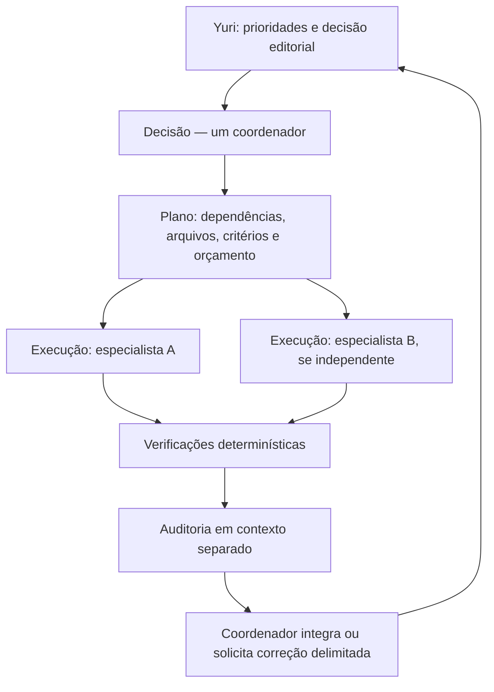

# Bacuri — auditoria de harnesses, agentes, modelos e RAG

## Retomada: preparação da avaliação RAG

Foi criado `docs/avaliacao/README.md`, com protocolo, rubrica humana, métricas e critérios para promover itens a conjunto-ouro, e `docs/avaliacao/perguntas.md`, com 30 perguntas candidatas. As respostas de referência P01–P24 estão em `docs/avaliacao/respostas-candidatas.md`: cada uma traz limites de formulação, fonte, URL, hash e página física/impressa. Foram conferidos 30 IDs únicos e os PDFs locais que sustentam esses itens; P08 conserva pendência bibliográfica explícita. P25–P27 permanecem condicionadas à aprovação humana de suas perguntas antecedentes, e P28–P30 são casos controlados. Não houve execução RAG, chamada paga ou alteração do índice. Próximo passo: Yuri revisar e aprovar ou devolver cada item; só então registrar históricos e promover itens a conjunto-ouro.

Correção do encerramento anterior: ambiente e triharness tiveram implementação parcial, não conclusão integral. O build continua sem validação bem-sucedida nesta sessão; atualizações de ferramentas, alinhamento da constituição/fluxo e configuração completa de coordenação/auditoria ainda demandam revisão antes de declarar essas fases encerradas.

Pesquisa e inspeção: 8 de setembro de 2026. **Proposta para escolha do Yuri; configurações e aplicação não alteradas.**

O Bacuri ainda não tem equivalência entre Codex, Claude Code e OpenCode. A base web está atualizada em vários componentes; as prioridades são corrigir as divergências de configuração, controlar delegações e melhorar a recuperação e a verificação documental. Recomendo um coordenador por tarefa, especialistas paralelos apenas quando houver independência e auditoria separada da execução. Para o produto, experimentar DeepSeek Flash e Pro com um conjunto de perguntas curadas antes de substituir o modelo público.

## Evidência e limites

Foram inspecionados a constituição, o contrato, o fluxo de trabalho, os dez arquivos de especialistas, configurações locais e globais pertinentes, o caminho do chat, ingestão e embeddings, migrações de busca, testes e CI. A comparação dos cinco pares confirmou nomes, descrições e corpos equivalentes entre Claude e OpenCode. A configuração efetiva e as skills do OpenCode foram consultadas por comandos de diagnóstico, com saída filtrada. Chaves não foram publicadas.

`npm test`: **83 testes passaram, em 10 arquivos**. `npm run lint`: **passou**. A consulta `npm outdated --json`, repetida com acesso à rede após falha de DNS no sandbox, encontrou novas versões principais de ESLint e TypeScript. Não foi executado build, teste visual, chamada de geração, benchmark de modelos, consulta ao banco remoto ou inspeção da configuração de produção. Testes com dublês não comprovam qualidade historiográfica nem disponibilidade real dos provedores.

As alterações que já estavam na pasta foram preservadas, inclusive o planejamento anterior, configurações e atualização de dependências. Este relatório complementa aquele planejamento e não o transforma em decisão aprovada.

## 1. Stack e comportamento atual

| Camada | Implementação observada | Avaliação |
|---|---|---|
| Aplicação | Next.js 16.3.4, React 19.2.8, TypeScript 6.0.3, Tailwind 4.3.3, Zod 4.5.4 | Manter a arquitetura simples; não há necessidade demonstrada de reescrever |
| Banco | Supabase JS 2.116.0; migrações Postgres/pgvector | Verificar busca e rastreabilidade antes de ampliar a arquitetura |
| Geração | `lib/server/llm.ts`: fetch compatível com Chat Completions; Groq, OpenRouter ou Ollama por ambiente | DeepSeek via OpenRouter cabe na abstração existente |
| Modelo local do chat | `LLM_PROVIDER=openrouter`, `LLM_MODELO=google/gemma-4-31b-it:free` | Configuração local, não comprovação do modelo em produção |
| Padrão do código | Groq, `llama-3.3-70b-versatile` | Distinguir padrão, ambiente local e ambiente publicado |
| Embeddings | E5-small multilíngue, 384 dimensões; Python na indexação, Transformers.js 4.2.0 no servidor Next.js na consulta | Manter os espaços vetoriais compatíveis; testar alinhamento Python/ONNX e quantização |
| Busca | RPC vetorial, até 8 trechos, limiar 0,82 | Ainda não implementa a busca híbrida descrita nos agentes |
| Acervo | Python, PyMuPDF, Tesseract, sentence-transformers e scripts por fonte | Fixar versões Python e medir qualidade por tipo de documento |
| Interface | Chat, fontes, feedback, curadoria, biografias e mapas Leaflet/OpenStreetMap | A revisão de conteúdo deve acompanhar a revisão da interface |

O atendimento público é um RAG sequencial: pergunta → embedding → busca → geração → registro. Os agentes nas pastas de desenvolvimento não participam automaticamente de cada resposta ao visitante. Essa separação deve continuar explícita.

A constituição ainda afirma que os embeddings da consulta rodam em uma Edge Function Supabase. O código e o contrato já usam o servidor Next.js. Os agentes descrevem busca híbrida, mas `supabase/migrations/0009_nota_contexto_chunk.sql` só calcula distância vetorial. São divergências documentais verificáveis, não hipóteses.

## 2. Modelos para a divisão solicitada

| Função | Claude Code | Codex | OpenCode via OpenRouter |
|---|---|---|---|
| Decisão | Fable 5.1 — `claude-fable-5-1` | Astra — `gpt-6-astra` | `openrouter/deepseek/deepseek-v4-pro-0813` |
| Execução | Sonnet 5 — `claude-sonnet-5` | Terra — `gpt-5.6-terra` | `openrouter/deepseek/deepseek-v4-flash-0731` |
| Auditoria | Opus 5 — `claude-opus-5` | Sol — `gpt-5.6-sol` | `openrouter/google/gemini-3.8-flash` |

Fable 5.1 foi lançado em 1º de setembro; Sonnet 5 e Opus 5 são as versões das famílias solicitadas no catálogo atual. A disponibilidade na API não comprova acesso no plano individual de Claude Code; conferir o seletor e o modelo efetivamente executado. Fontes: [Fable 5.1](https://platform.claude.com/docs/en/models/fable-5-1/overview), [Sonnet 5](https://platform.claude.com/docs/en/models/sonnet-5/overview), [Opus 5](https://platform.claude.com/docs/en/models/opus-5/overview).

O catálogo oficial OpenAI e o cache local do Codex confirmam `gpt-6-astra`, `gpt-5.6-terra` e `gpt-5.6-sol`. Portanto, não se deve transformar Terra e Sol em supostos modelos da geração 6 apenas porque Astra está nela. Fonte: [modelos OpenAI](https://developers.openai.com/api/docs/models).

A DeepSeek registra as atualizações Flash de 31/07 e Pro de 13/08. No OpenRouter, os identificadores explícitos são `deepseek/deepseek-v4-flash-0731` e `deepseek/deepseek-v4-pro-0813`; o catálogo consultado também confirma `google/gemini-3.8-flash`, lançado em 02/09. Fontes: [changelog DeepSeek](https://api-docs.deepseek.com/updates/), [Flash 0731](https://openrouter.ai/deepseek/deepseek-v4-flash-0731), [Pro 0813](https://openrouter.ai/deepseek/deepseek-v4-pro-0813), [Gemini 3.8 Flash](https://openrouter.ai/google/gemini-3.8-flash).

**Diferença de nomenclatura:** no OpenCode há o prefixo do conector `openrouter/`; no campo `model` enviado pela aplicação à API OpenRouter ele não entra. Exemplo do webapp: `LLM_MODELO=deepseek/deepseek-v4-flash-0731`. A estrutura de identificação do OpenCode é `provider_id/model_id`. Fonte: [modelos no OpenCode](https://opencode.ai/docs/models/).

Recomendo fixar as versões verificadas e revisar o catálogo periodicamente. Aliases móveis facilitam atualizações, mas podem mudar o comportamento sem uma alteração no Git. Para pesquisa acadêmica, registrar versão, provedor efetivo, parâmetros e data melhora a reprodutibilidade. Não confundir os aliases da API direta DeepSeek com os identificadores e aliases próprios do OpenRouter.

## 3. O que falta para ser triharness

| Item | Evidência atual | Adaptação proposta |
|---|---|---|
| Constituição | `CLAUDE.md` e `docs/fluxo-de-trabalho.md` descrevem dois harnesses e vedam paralelismo | Registrar a política escolhida para três harnesses |
| Agentes Claude | Cinco especialistas, `haiku`/`sonnet`/`opus` | Separar função de decisão, execução e auditoria; fixar os modelos desejados |
| Agentes OpenCode | Cinco especialistas; quatro `deepseek-v4-pro` e um `deepseek-v4-vl`, sem provedor | Usar IDs completos OpenRouter, `mode` e permissões explícitas |
| Agentes Codex | `.codex/config.toml` só configura integrações; não há agentes locais equivalentes | Criar definições nativas TOML |
| Principal OpenCode | Diagnóstico efetivo sem `model`, `small_model` ou `default_agent` | Fixar coordenador, auxiliares e modelos |
| Principal Claude | Configuração global `opus[1m]` | Ajustar a decisão para Fable conforme preferência e acesso |
| Principal Codex | Configuração global Astra, esforço `high` | Fixar o projeto e definir esforço/modelo dos filhos para evitar herança cara |
| MCPs | Codex: Context7/Supabase/Vercel; OpenCode: Context7; `.mcp.json` vazio | Disponibilizar por função, sem copiar todos os MCPs para todos |
| Skills Bacuri | Não há skills locais próprias | Extrair procedimentos reutilizáveis dos agentes, se aprovado |

O OpenCode **realmente carregou** os cinco arquivos de especialistas, mas manteve os nomes de modelo incompletos. Carregar o arquivo não comprova que a chamada do modelo funcionará. Seu catálogo local reconhece os dois DeepSeek atualizados e não listou Gemini 3.8 Flash. Atualizar o OpenCode e verificar novamente; se necessário, registrar o modelo no provedor OpenRouter com capacidades documentadas. A integração aceita inclusão explícita de modelos. Fonte: [OpenRouter no OpenCode](https://opencode.ai/docs/providers/#openrouter).

Não encontrei confirmação oficial de `deepseek-v4-vl`. A variante visual documentada é `deepseek-v4-flash-vision-exp`, experimental. Ela só merece um piloto de OCR/visão se houver ganho medido sobre o processo local; não é necessária para executar scripts de ingestão. Fonte: [lançamentos DeepSeek](https://api-docs.deepseek.com/updates/).

## 4. Adaptação nativa de cada harness

**Codex.** A documentação atual define agentes locais em `.codex/agents/*.toml`, com `name`, `description` e `developer_instructions`; modelo e esforço podem ser definidos por agente. A configuração central admite modelo padrão dos filhos e limite de concorrência. Proponho Terra nos executores e Sol nos auditores, com revisão das permissões efetivas: configurações de execução da sessão também influenciam os filhos. Não basta copiar os arquivos Markdown do Claude para essa pasta. Fonte: [subagentes Codex](https://learn.chatgpt.com/docs/agent-configuration/subagents).

**Claude Code.** Preservar `.claude/agents/*.md`, acrescentando modelos, ferramentas e limites adequados à função. O modelo passado numa invocação pode prevalecer sobre o arquivo; variáveis de ambiente e listas de modelos permitidos também influenciam a resolução. Conferir `/tasks` em uma validação futura. `Explore` já pode herdar um modelo caro: não presumir que toda exploração use Haiku. Fonte: [subagentes Claude Code](https://code.claude.com/docs/en/sub-agents).

O projeto já ativa `CLAUDE_CODE_EXPERIMENTAL_AGENT_TEAMS=1` em `.claude/settings.local.json`, em conflito com a vedação documental ao paralelismo. Agent Teams continua experimental, com limitações próprias de retomada. Isso não significa que algum time tenha sido executado. Fonte: [Agent Teams](https://code.claude.com/docs/en/agent-teams).

Há também **Dynamic Workflows**: scripts JavaScript que coordenam subagentes e podem ser reutilizados. São úteis em auditorias de muitos documentos ou migrações amplas. A opção `workflowSizeGuideline=small` orienta a escala, mas **não impõe um teto rígido**. Minha proposta inicial é usar subagentes convencionais com concorrência pequena; experimentar workflows em um lote delimitado. Esse script é específico do Claude e precisaria de outro executor nos demais harnesses. Fonte: [Dynamic Workflows](https://code.claude.com/docs/en/workflows).

**OpenCode.** Definir coordenador como `primary`, especialistas como `subagent`, e limitar delegações via `permission.task`. Hoje os arquivos omitem `mode`; o padrão documentado é `all`. Auditores precisam de permissões de leitura, com execução apenas dos verificadores necessários. `steps` limita iterações, não dólares nem tokens. Configurar também os agentes internos de exploração, compactação, título e resumo conforme sua função; não presumir que todos usem `small_model`. Fonte: [agentes OpenCode](https://opencode.ai/docs/agents/).

**Skills.** Uma skill descreve como fazer uma tarefa; o agente define quem a faz, em qual modelo e com quais permissões. Proponho inicialmente quatro procedimentos: `avaliar-rag`, `auditar-proveniencia`, `verificar-webapp` e `entregar-tarefa`. Armazenar o conteúdo comum uma vez e gerar adaptações de descoberta/metadados, sem modelos de outro harness nos corpos compartilhados. Codex descobre `.agents/skills`; Claude documenta `.claude/skills`; OpenCode também pode descobrir `.agents/skills` e `.claude/skills`. Evitar publicar a mesma skill em todos os caminhos que um único harness percorre. Fontes: [skills Codex](https://learn.chatgpt.com/docs/build-skills), [skills Claude](https://code.claude.com/docs/en/skills), [skills OpenCode](https://opencode.ai/docs/skills/).

## 5. Vazamento de contexto e gasto desnecessário

**Não há evidência suficiente para afirmar cobrança cruzada indevida.** O que foi comprovado são mecanismos de herança e configurações abertas a escolhas imprevistas. Não foram consultados extratos de uso.

| Achado | Consequência possível | Proposta |
|---|---|---|
| OpenCode sem modelo e provedor fixos | Seleção depende do último modelo e do ambiente | Restringir provedores a OpenRouter e fixar principal e auxiliares |
| Credenciais OpenCode para `openrouter` e `deepseek`; histórico recente inclui ambos | Há caminho disponível para API direta, embora o objetivo seja OpenRouter | Desabilitar o provedor direto neste projeto, preservando a conta global |
| Regras de compatibilidade Claude no OpenCode | Pode carregar instruções e skills de outro ambiente | Manter entrada explícita e controlar descoberta de compatibilidade |
| `find-docs` e `context7-mcp` cobrem consultas semelhantes | Duas instruções podem solicitar a mesma pesquisa | Escolher uma regra principal de documentação por projeto |
| Muitos plugins/skills globais visíveis no Codex | Aumenta catálogo de instruções e ambiguidade de acionamento | Perfil Bacuri enxuto, com ferramentas carregadas por necessidade |
| Modelos de filhos não definidos no Codex | Execução rotineira pode herdar Astra e esforço alto | Definir Terra explicitamente e esforço adequado |
| Corpos de agentes explicam os dois harnesses | Cada especialista recebe instruções de adaptação alheias | Corpo neutro e adaptação no cabeçalho/arquivo nativo |
| Escopos apenas em texto e com sobreposição | Trabalho duplicado e conflitos de edição | Dono por arquivo/tarefa; isolamento quando necessário |

O diagnóstico de skills do OpenCode resolveu `find-docs`, `context7-mcp` e `playwright-cli` em `~/.agents/skills`, além de uma skill interna. Existem cópias das duas primeiras em `~/.claude/skills`, mas **o diagnóstico não mostrou carregamento duplicado delas**. Não atribuir tokens duplicados sem medição.

A compatibilidade OpenCode usa `CLAUDE.md` como fallback quando não encontra `AGENTS.md`. Aqui encontra `AGENTS.md`, que manda ler `CLAUDE.md`: isso é uma ponte intencional, não execução do Claude. Existem controles para desabilitar a descoberta de prompts/skills Claude; adotar somente depois de garantir o acesso às regras comuns. Fonte: [precedência e compatibilidade OpenCode](https://opencode.ai/docs/rules/).

Instalar um plugin originado no ecossistema Claude dentro do Codex não significa chamar um modelo Anthropic. O nome do marketplace não identifica o provedor de inferência. Da mesma forma, ler um arquivo de outro harness não aciona sua cobrança; a leitura consome contexto no modelo que está trabalhando.

Para demonstrar isolamento, uma verificação futura deve registrar **harness, agente, modelo solicitado, modelo executado, provedor, tokens e custo quando disponível**, usando uma tarefa curta por papel. Comparar com o painel OpenRouter e o uso de cada assinatura. Chaves distintas para desenvolvimento, avaliação e produto permitem separar orçamentos; não há confirmação de que essa separação exista hoje. O OpenRouter fornece contabilidade de uso na resposta da API. Fonte: [usage accounting](https://openrouter.ai/docs/cookbook/administration/usage-accounting).

## 6. Organização recomendada

| Função | Agentes propostos | Responsabilidade |
|---|---|---|
| Decisão | `coordenador` | Delimitar tarefa, resolver dependências e integrar resultados; decisão editorial final continua humana |
| Execução | Os cinco especialistas atuais | Engenharia de ingestão, ciência de dados, backend, frontend e produção editorial |
| Auditoria técnica | `auditor-tecnico` | Conferir evidências de testes, regressões, contrato, uso de modelos e escopo |
| Auditoria editorial | `auditor-historiografico` | Conferir atribuição, fontes, páginas, contexto e sustentação de afirmações |

O `curador-historiador` atual mistura escrita e fiscalização. Ele pode continuar produzindo rascunhos na execução, com o modelo de execução do harness; quando houver publicação histórica, outro contexto deve revisar o resultado com o modelo de auditoria. Dois auditores não precisam rodar em toda tarefa: código sem conteúdo editorial demanda auditoria técnica; classificação e texto público demandam revisão historiográfica; mudanças que afetem ambos recebem as duas.

Paralelizar frontend e backend depois de fechar o contrato é viável. Paralelizar dois agentes que alteram a mesma migração ou taxonomia exige sequenciamento. `pipeline/`, `supabase/` e `docs/taxonomia.md` têm escopos sobrepostos; além disso, `app/` inclui `app/api/`. A divisão deve explicitar exclusões. `lib/shared/`, testes, CI e configurações carecem de dono claro nas regras atuais.

Cada delegação deve receber objetivo, arquivos, entradas, critérios de aceite e uma entrega curta com evidências. Evitar cópia integral de conversas e documentos. Começar com até dois executores independentes, bloquear delegação recursiva por padrão e definir limite de retrabalho. Scripts de comparação, lint e testes devem fazer o que não precisa de LLM. A alegação antiga de um multiplicador universal de tokens por subagente não é uma base válida para orçamento: medir o consumo por tarefa concluída.

## 7. Melhorias do RAG em ordem de prioridade

1. **Limites e rastreabilidade.** O histórico limita seis mensagens, mas `conteudo: z.string()` não limita seu tamanho. A chamada ao LLM não define teto de saída nem tempo máximo, faz até três tentativas e descarta `usage`. Adicionar orçamento de entrada/saída, cancelamento, prazo total, identificação de tentativas e registro de modelo/provedor. O rate limit em memória é por instância e não contém sozinho o custo de um serviço distribuído.
2. **Verificar citações.** A API monta as referências antes de gerar a resposta e aceita o texto sem conferir os marcadores. Validar índices inexistentes e ausência de referências; guardar `chunk_id`, versão/hash e relação entre afirmações e evidências. Validação sintática não demonstra que uma fonte sustenta a afirmação: avaliar isso separadamente.
3. **Busca híbrida medida.** Combinar busca por termos em português e busca vetorial, preservar nomes/siglas/datas e comparar com o resultado atual. Avaliar reranking apenas se melhorar o conjunto de referência. Não trocar embeddings sem planejar reindexação e validar consultas/documentos juntos.
4. **Perguntas de continuação.** “E em Minas Gerais?” hoje é buscada isoladamente, embora o histórico entre na geração. Testar reformulação contextual restrita ao que o usuário disse, sem inventar premissas nem tratar respostas anteriores como documentos do acervo.
5. **Conjunto de avaliação.** O caminho `docs/avaliacao` citado no agente não foi encontrado. Começar com aproximadamente 30–50 perguntas validadas, incluindo nomes, datas, recortes regionais, fontes contraditórias, documentos repressivos reproduzidos e perguntas sem base. Medir recuperação, sustentação de afirmações, qualidade das referências, recusa correta, custo e latência.
6. **Fronteira documental.** Tratar trechos recuperados e histórico como dados, sem permitir que instruções neles substituam as regras editoriais. Preservar distinção entre texto da comissão, documento reproduzido e nota de contexto.
7. **Experiência educacional.** Diferenciar síntese didática e investigação aprofundada, mantendo referências acessíveis. Streaming pode melhorar a espera, mas exige decidir como apresentar conteúdo ainda não verificado. Não há necessidade de expor raciocínio interno do modelo.

São recomendações derivadas do código e dos princípios do Bacuri, não ganhos de qualidade já medidos. O comportamento atual de não chamar o LLM quando a busca retorna vazia é uma salvaguarda importante, já coberta por teste, que deve ser preservada.

## 8. DeepSeek na geração do webapp

| Caminho | Funcionamento | Benefício | Limite |
|---|---|---|---|
| Flash único | Flash 0731 recebe os trechos e gera a resposta | Integração simples; referência inicial de custo e qualidade | Pode exigir melhorias para sínteses complexas |
| Flash + Pro seletivo — recomendado após avaliação | Flash atende consultas comuns; Pro recebe as tarefas que exigem síntese mais complexa | Direciona gasto para onde houver ganho demonstrado | Precisa de critérios de encaminhamento e medição |
| Pro único | Pro 0813 gera todas as respostas com base recuperada | Menos lógica de encaminhamento | Custo e latência precisam ser medidos no acervo |
| Avaliação sem alterar o público | Executa um conjunto curado com o modelo atual, Flash e Pro | Permite decidir com evidências | Ainda não melhora imediatamente o atendimento |

Para a opção seletiva, preferir escolher o modelo **antes** da geração usando critérios simples — modo de pesquisa, número de fontes e complexidade definida — a pagar Flash e Pro em toda pergunta. Não promover para Pro só porque não há documentação: ausência de fonte deve continuar produzindo a resposta honesta sem geração. Uma segunda busca pode ser experimentada com limite explícito e avaliação própria.

O teste mínimo de configuração do webapp usaria `LLM_PROVIDER=openrouter` e `LLM_MODELO=deepseek/deepseek-v4-flash-0731` ou `deepseek/deepseek-v4-pro-0813`. Isso não exige AI SDK, LangGraph ou outro framework novo. Para operação pública, completar primeiro os limites e a validação descritos acima. Não alterei `.env.local`.

Os endpoints de um mesmo modelo no OpenRouter podem ter preços, políticas e suporte a parâmetros diferentes. Para chamadas de ferramentas dos agentes, exigir compatibilidade efetiva com ferramentas; para saída estruturada no RAG, exigir suporte ao formato escolhido. `require_parameters` impede roteamento para endpoints incompatíveis; restrições de provedor, preço e retenção devem ser compatíveis com a disponibilidade desejada. ZDR é uma restrição específica de retenção, distinta de simplesmente negar coleta. Fonte: [roteamento OpenRouter](https://openrouter.ai/docs/guides/routing/provider-selection).

Controlar o orçamento de raciocínio usando os parâmetros aceitos pelo modelo/provedor. `reasoning.exclude` oculta esse conteúdo na resposta, mas não equivale a desativar raciocínio nem garantir economia. Em agentes com ferramentas, preservar o protocolo de mensagens exigido pelo modelo; no produto público, exibir a resposta e as evidências documentais. Fonte: [reasoning no OpenRouter](https://openrouter.ai/docs/guides/best-practices/reasoning-tokens).

Na consulta, a página de Flash anunciava preços a partir de US$ 0,05/0,16 por milhão de tokens de entrada/saída, e a de Pro listava, entre outros, o endpoint DeepSeek a US$ 0,66/1,98. São preços de endpoints específicos, não orçamento garantido para a configuração final. Filtros de ferramentas e retenção podem excluir os mais baratos; raciocínio, tentativas, câmbio e taxas também influenciam o gasto. Fontes: [preços Flash](https://openrouter.ai/deepseek/deepseek-v4-flash-0731), [preços Pro](https://openrouter.ai/deepseek/deepseek-v4-pro-0813).

**Conteúdo além do chat:** Flash pode preparar rascunhos de atividades didáticas e fichas de leitura; Pro pode ser comparado em sínteses entre documentos e rascunhos de biografias/eventos. Cada afirmação factual deve trazer sua evidência. Registrar estados de rascunho, revisado e publicado, com decisão humana e versão do modelo. Começar por um pequeno lote curado, sem escrita automática nas tabelas públicas. Não reindexar saídas geradas como se fossem fontes primárias. Auditoria por outro LLM auxilia, mas não substitui crítica documental humana.

## 9. Atualizações concretas

| Componente | Observado | Proposta |
|---|---|---|
| Codex CLI | 0.153.4; release estável confirmado | Manter; não há motivo demonstrado para migrar ao alpha |
| OpenCode | 1.17.14; release consultado 1.18.29 | Atualizar, preservar configuração/estado e repetir diagnóstico de modelos e ferramentas |
| Claude Code | 2.1.265 local; página `latest` consultada mostrava 2.1.263 | Não fazer downgrade; há divergência entre instalação e publicação consultada |
| Vercel CLI | Aviso do ambiente: 59.11.7 → 59.12.0 | Recomendo atualizar com `npm i -g vercel@latest` em etapa de manutenção |
| Node | Local 22.23.1; CI 20; pacote exige >=22.12.0; tipos Node 26 | Alinhar local, CI, produção e tipos, preferencialmente em Node 24 LTS |
| TypeScript | 6.0.3; npm informa 7.0.2 | Avaliar migração principal em tarefa própria, com compatibilidade Next/testes |
| ESLint | 9.39.5; npm informa 10.10.0 | Verificar compatibilidade de plugins/configuração antes de migrar |
| Dependências Python | Sem versões em `requirements.txt` | Criar ambiente reproduzível com versões testadas |

Fontes das versões dos harnesses: [OpenCode 1.18.29](https://github.com/anomalyco/opencode/releases/tag/v1.18.29), [changelog Codex](https://learn.chatgpt.com/docs/changelog), [release Claude consultado](https://github.com/anthropics/claude-code/releases/tag/v2.1.263). Node 20 está EOL, enquanto 22 e 24 são LTS; a incompatibilidade do CI com `engines` já existe independentemente da opção de migrar para 24. Fonte: [releases Node.js](https://nodejs.org/en/about/previous-releases).

A consulta npm não apontou atualização para as demais dependências diretas. Isso não é auditoria de segurança. A arquitetura deve continuar seguindo a documentação embarcada em `node_modules/next/dist/docs/`, inclusive o bloco gerado em `AGENTS.md`. Incluir no CI a verificação de equivalência dos agentes, validação de configurações e typecheck/build; reservar testes de RAG reais para um conjunto controlado que não gere custo em todo push.

## 10. Decisões do Yuri — 8 de setembro de 2026

| Tema | Decisão |
|---|---|
| Paralelismo | Um harness por tarefa, com até três especialistas em paralelo quando não disputarem arquivos ou decisões |
| Manutenção triharness | Uma fonte comum de instruções, com adaptações geradas para cada harness |
| Triagem | Não criar função ou agente de triagem; o termo foi rejeitado |
| Modelos | Fixar as versões verificadas e revisar periodicamente |
| Chat RAG | Escolha reaberta: comparar opções antes de definir modelo e provedor do produto |
| Conteúdo editorial | Atividades didáticas, fichas, biografias e eventos em lote curado, com revisão humana antes de publicação |
| Ordem das etapas | Atualizações de ambiente → triharness e custos → RAG |
| Paralelismo Claude | Subagentes convencionais agora; experimento de Dynamic Workflow somente depois, em lote documental delimitado |
| Provedores de desenvolvimento | OpenRouter apenas no OpenCode; Codex e Claude Code permanecem em seus acessos nativos |
| OpenRouter no RAG | Ainda não decidido; avaliar separadamente se compensa para embeddings ou geração no produto |

Esta correção separa duas arquiteturas: o OpenRouter do OpenCode pertence ao ambiente de desenvolvimento; o pipeline RAG do Bacuri só deve usar OpenRouter se uma avaliação posterior mostrar vantagem concreta. Uma credencial do OpenCode não deve ser reutilizada silenciosamente pela aplicação ou pela ingestão.

O orçamento do piloto DeepSeek não foi definido. Antes de qualquer chamada paga, registrar um teto em reais ou dólares e o conjunto de perguntas de avaliação. As decisões acima autorizam planejamento e configuração local; não autorizam publicação, cobrança, alteração de dados de produção ou troca silenciosa do modelo público.

## 11. Embeddings e ingestão: opções de aprendizado

Embeddings não são modelos que escrevem respostas. Eles transformam perguntas e trechos em coordenadas numéricas, para que a busca encontre proximidade de significado. Trocar o modelo exige reindexar **todos** os chunks e gerar consultas no mesmo modelo: vetores de modelos distintos não são comparáveis.

| Opção | Onde roda | Quando vale estudar | Principal custo ou limite |
|---|---|---|---|
| `intfloat/multilingual-e5-small` — atual | Máquina local, CPU | Referência simples, aberta e já integrada | Menor capacidade que alternativas maiores; 384 dimensões |
| `Alibaba-NLP/gte-multilingual-base` | Máquina local, CPU | Próximo experimento recomendado: 75 idiomas, licença Apache-2.0 e porte ainda razoável | Reindexação; adaptar o código Node ou levar também a consulta para um serviço de embeddings |
| `BAAI/bge-m3` | Máquina local, preferencialmente máquina mais forte | Pesquisa híbrida nativa: vetor denso, vetor esparso e interação tardia; textos longos | Mais pesado e complexo; a busca deve mudar junto, não só o modelo |
| Qwen3 Embedding 0.6B/4B/8B | Local ou catálogo OpenRouter, conforme modelo disponível | Comparar qualidade e reranking em português; a família oferece portes diferentes | 8B ocupa cerca de 15 GB só em pesos; validar licença, dimensão e suporte no runtime escolhido |
| `openai/text-embedding-3-small` ou outro catálogo de embeddings OpenRouter | API OpenRouter | Centralizar credencial, métricas e cobrança em um provedor | Não é modelo aberto, exige conexão e altera dimensão/schema; não escolher sem avaliação |
| Reranker separado | Local ou OpenRouter | Reordenar os 20–50 candidatos após a busca híbrida | Acrescenta latência e custo; só manter se melhorar a avaliação |

Minha recomendação para o Bacuri é manter E5 como baseline e comparar primeiro **GTE multilingual base** em perguntas curadas. Só depois testar BGE-M3 ou Qwen3 com um recorte pequeno. A escolha deve ser feita por Recall@8, precisão das fontes, consultas em português, nomes próprios, siglas e datas, tempo em CPU e custo — não por ranking geral. O GTE declara 75 idiomas e licença Apache-2.0; BGE-M3 reúne recuperação densa, esparsa e multi-vetor; Qwen3 oferece modelos de embedding e reranking de 0,6B a 8B. Fontes: [GTE multilingual base](https://huggingface.co/Alibaba-NLP/gte-multilingual-base), [BGE-M3](https://huggingface.co/BAAI/bge-m3), [Qwen3 Embedding](https://huggingface.co/Qwen/Qwen3-Embedding-8B).

OpenRouter expõe `POST /api/v1/embeddings`, devolvendo modelo, vetores e uso de tokens. Isso permite concentrar credencial e observabilidade, mas não obriga a abandonar o modelo local. Para o princípio de software livre, o caminho local deve permanecer como referência, inclusive para comparar custo e privacidade. Fonte: [API de embeddings OpenRouter](https://openrouter.ai/docs/api/api-reference/embeddings/create-embeddings).

Para a ingestão, separar quatro trabalhos: baixar com proveniência; extrair texto/layout; OCR quando necessário; validar e inserir chunks no banco. LLM não deve decidir automaticamente autoria, página ou interpretação histórica. Ele pode sugerir metadados em um rascunho que a curadoria revise.

| Ferramenta | Função | Melhor uso no Bacuri | Decisão sugerida |
|---|---|---|---|
| PyMuPDF + Tesseract — atual | Extrai texto de PDF e faz OCR | PDFs simples ou escaneados, com controle direto por página | Manter como caminho-base e referência de comparação |
| Docling | Converte PDFs, Office, HTML e imagens para estrutura/Markdown/JSON, detectando layout e tabelas | Relatórios com tabelas, colunas, notas e estrutura editorial complexa | Pilotar em 10 documentos variados antes de substituir scripts existentes |
| OCR no Docling: Tesseract, RapidOCR, EasyOCR e outros | Escolhe motor de OCR dentro de uma conversão estruturada | Testar Tesseract contra RapidOCR em páginas degradadas, com idioma português | Não trocar OCR sem amostra humana e taxa de erro por página |
| Unstructured | Particiona documentos em elementos e pode usar OCR/layout | Alternativa quando a diversidade de formatos crescer | Não introduzir junto com Docling: compare os dois no mesmo lote |
| `COPY`/upsert do Postgres via Supabase Python | Grava lotes de fontes/chunks e permite idempotência | Carga de metadados, chunks e embeddings já validados | Evoluir os scripts atuais; manter migrações SQL como fonte de verdade |
| Fila/automação Supabase | Reage a novos documentos e gera embeddings de modo assíncrono | Apenas quando a ingestão deixar de ser manual e por lote | Adiar: acrescenta operação e não substitui a revisão humana |

Docling é uma opção FOSS especialmente interessante para aprendizado porque produz uma representação estruturada antes de chunkar; suporta PDFs, DOCX, HTML, planilhas, imagens e outros formatos, e seus próprios documentos recomendam habilitar OCR, tabelas e recursos pesados apenas quando necessários. Pode rodar em CPU, mas instala PyTorch e aumenta bastante o ambiente. Fontes: [Docling](https://docling-project.github.io/docling/), [instalação e OCR](https://docling-project.github.io/docling/getting_started/installation/), [formatos e saída para chunks](https://github.com/docling-project/docling/blob/main/docs/usage/supported_formats.md).

O banco atual pode permanecer Supabase/Postgres/pgvector. A melhoria prioritária não é migrar para outro banco vetorial: é implementar busca híbrida com `tsvector`/índice GIN para nomes, siglas e datas, combinar com HNSW/pgvector por Reciprocal Rank Fusion e comparar no conjunto curado. Fonte: [busca híbrida Supabase](https://supabase.com/docs/guides/ai/hybrid-search).

Minha sequência proposta, agora alinhada às decisões do Yuri, é: **atualizar ferramentas e CI → configurar Codex e Claude Code nativamente e OpenCode via OpenRouter → criar avaliação RAG → comparar embeddings e implementar busca híbrida → pilotar Docling → escolher separadamente o provedor e o modelo do webapp**. Não foi contratado serviço, feita migração, publicada alteração, reindexado acervo ou executada geração paga nesta análise.
