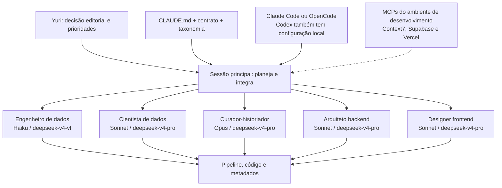
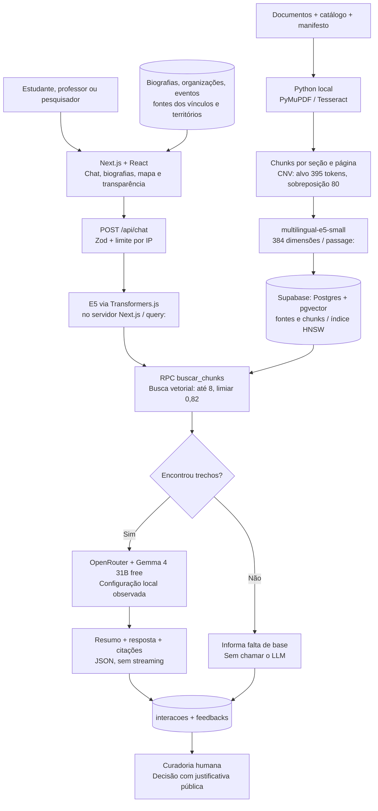
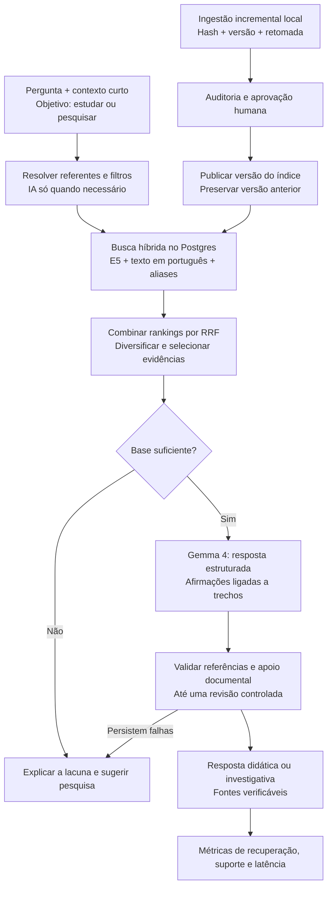
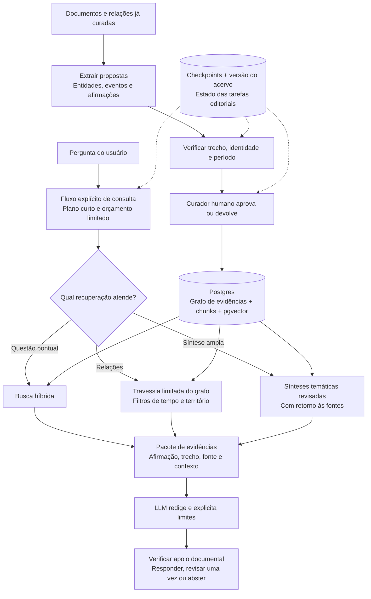
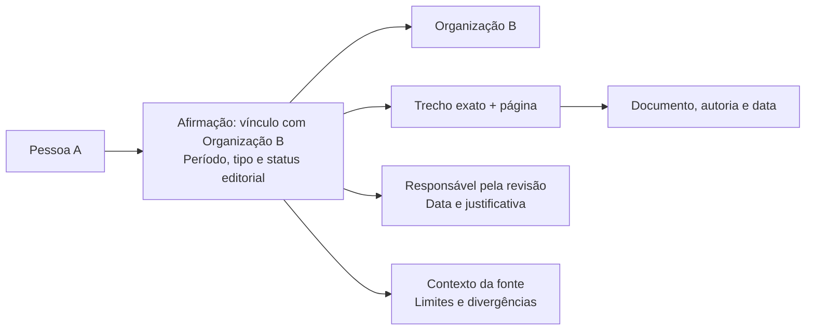

# Bacuri: arquitetura atual e duas alternativas de evolução

Data da análise e da pesquisa: 8 de setembro de 2026. Status: proposta para discussão, sem implementação ou alteração das decisões vigentes.

## 1. Entendimento do projeto e recomendação

O Bacuri é um projeto de História Pública e Ensino de História do ProfHistória/UFU: um assistente educacional e de pesquisa historiográfica sobre a Ditadura Militar-Empresarial brasileira, articulado a um acervo documental, biografias, mapas e curadoria colaborativa. A função da IA é ajudar a localizar, relacionar e compreender evidências, preservando autoria, contexto de produção, páginas e links. A decisão editorial pertence às pessoas responsáveis pela curadoria.

O projeto precisa atender tanto à pergunta inicial de um estudante quanto à investigação de um pesquisador. Isso implica distinguir síntese didática, crítica da fonte e interpretação historiográfica; reconhecer insuficiência documental; e preservar os compromissos de memória, verdade, justiça, combate ao negacionismo e análise das relações de classe e suas intersecções. Blog/revista e fórum aparecem na visão do produto, mas não encontrei módulos correspondentes nas rotas inspecionadas.

**Recomendação: adotar a alternativa 1 como base e experimentar a alternativa 2 em um recorte curado.** O principal ganho imediato virá da recuperação e da verificação de evidências. A stack web e o modelo localmente configurado já são recentes; substituir tudo não se justifica pelos achados desta análise.

Escopo da evidência: arquivos do estado atual da pasta de trabalho, incluindo alterações pré-existentes, mais documentação oficial e artigos disponíveis na internet. Não consultei o banco remoto, as variáveis da Vercel ou chamadas reais aos modelos. Portanto, configuração local, implementação no repositório e comportamento comprovado em produção são coisas distintas. Não foram medidos custos, latência ou qualidade das respostas. O catálogo local contém **112 entradas**, o que não comprova 112 fontes publicadas ou indexadas no banco.

## 2. Arquitetura agêntica atual: a equipe que constrói o produto

As setas representam delegações possíveis, **uma de cada vez**, conforme a regra do projeto. Esses especialistas trabalham na construção e na curadoria do Bacuri; não são cinco agentes conversando para responder a cada visitante.

| Especialista | Capacidades hoje descritas nos agentes | Claude | OpenCode |
|---|---|---|---|
| Engenheiro de dados | Download, OCR, extração, normalização, manifesto e proveniência | `haiku` | `deepseek-v4-vl` |
| Cientista de dados | Chunking, embeddings, banco vetorial, classificação e avaliação | `sonnet` | `deepseek-v4-pro` |
| Curador-historiador | Taxonomia, crítica documental, auditoria e textos editoriais | `opus` | `deepseek-v4-pro` |
| Arquiteto backend | API, recuperação, geração, autenticação e dados | `sonnet` | `deepseek-v4-pro` |
| Designer frontend | Chat, referências, acessibilidade, biografias e mapa | `sonnet` | `deepseek-v4-pro` |

Os cinco pares de arquivos têm corpos idênticos entre `.claude/agents/` e `.opencode/agents/`, confirmado por comparação. Os nomes e descrições também correspondem. `haiku`, `sonnet` e `opus` são aliases: os arquivos não fixam uma versão exata. O modelo da sessão principal não é fixado pelas configurações de projeto inspecionadas.

Há pendências de resolução dos modelos OpenCode. Seus arquivos usam nomes sem provedor, enquanto a documentação atual orienta referências `provider/model`. Além disso, não confirmei `deepseek-v4-vl` no catálogo oficial consultado; ele apresenta `deepseek-v4-flash`, `deepseek-v4-pro` e `deepseek-v4-flash-vision-exp`. Isso pede conferência com a versão e o catálogo do OpenCode instalado, sem presumir que um alias particular necessariamente falhe. A gratuidade do acesso desses agentes também não está comprovada pela configuração. Fontes: [modelos no OpenCode](https://opencode.ai/v2/docs/models) e [API oficial DeepSeek](https://api-docs.deepseek.com/).

### Skills, ferramentas e modelos não são a mesma camada

Uma skill é um procedimento reutilizável; um agente é um papel com instruções e permissões; um modelo é o mecanismo de IA; um MCP conecta o assistente a ferramentas externas.

Não há skills locais separadas identificadas nas pastas convencionais inspecionadas. As capacidades especializadas estão nos cinco agentes e em `CLAUDE.md`. O ambiente desta sessão oferece skills externas de documentação, navegador, Vercel, visualização e outras, mas sua disponibilidade não as transforma em dependências do chatbot.

O `.mcp.json` está vazio. `.opencode/opencode.jsonc` configura Context7. `.codex/config.toml` configura Context7, Supabase e o MCP do plugin Vercel; desativa algumas integrações alheias ao projeto. Há, portanto, uma terceira entrada de desenvolvimento via Codex, mas não encontrei um terceiro conjunto equivalente de cinco agentes nessa pasta. MCPs de administração do banco e deploy pertencem ao ambiente de desenvolvimento, não à interface pública de consulta histórica.

## 3. Arquitetura atual: o produto que responde ao público

O chatbot implementa um **RAG sequencial**: recupera trechos, inclui-os no contexto e pede ao LLM uma resposta. Não encontrei planejamento autônomo, laço de ferramentas, LangGraph ou GraphRAG no atendimento público. O histórico acompanha a geração, mas a busca usa apenas a última pergunta. As relações estruturadas das biografias e dos eventos alimentam outras partes da interface; a rota de chat não as consulta.

| Camada | Stack observada |
|---|---|
| Web | Next.js **16.3.4**, React **19.2.8**, TypeScript **6.0.3**, Tailwind **4.3.3** |
| API | Route Handlers no mesmo Next.js, runtime Node.js, Zod e `fetch` nativo |
| Banco e acesso | Supabase JS **2.116.0**, Postgres/pgvector; Supabase Auth para curadores |
| Ingestão | Python local, PyMuPDF, Tesseract/pytesseract, Pillow, sentence-transformers |
| Embeddings | `intfloat/multilingual-e5-small` na indexação; versão `Xenova/multilingual-e5-small` na consulta, Transformers.js **4.2.0** |
| Geração localmente selecionada | `LLM_PROVIDER=openrouter`; `LLM_MODELO=google/gemma-4-31b-it:free` |
| Outros provedores previstos no código | Groq, padrão `llama-3.3-70b-versatile`; Ollama, modelo obrigatório por variável |
| Mapa | Leaflet **1.9.4**, React Leaflet **5.0.0**, OpenStreetMap |
| Validação técnica | Vitest **5.0.0**, Playwright **1.63.0**; GitHub Actions para lint e testes |
| Publicação documentada | Vercel Hobby, ligada ao GitHub/main; configuração remota não auditada |

As versões JavaScript são as resolvidas no lockfile atual. As dependências Python estão sem versões fixadas em `requirements.txt`. Os embeddings Python/JavaScript pretendem representar o mesmo modelo; a equivalência prática entre implementações e precisões ainda merece teste de recuperação.

A página do OpenRouter confirma o identificador gratuito do Gemma 4, sujeito a limites. A ficha oficial Google informa licença Apache 2.0 para essa geração. A Groq informa descontinuação de Llama 3.3 70B em **16/08/2026 para free/developer**, com exceção empresarial: o padrão no código precisa ser revisto antes de voltar a esse provedor. Fontes: [OpenRouter/Gemma](https://openrouter.ai/google/gemma-4-31b-it:free), [ficha Gemma 4](https://ai.google.dev/gemma/docs/core/model_card_4) e [descontinuações Groq](https://console.groq.com/docs/deprecations).

## 4. Principais achados e prioridades

| Achado comprovado no repositório | Implicação | Prioridade proposta |
|---|---|---|
| Agentes prometem busca híbrida; SQL implementa apenas distância vetorial | Nomes, siglas e datas não têm uma via lexical complementar | Alta |
| `CLAUDE.md` ainda descreve embeddings em Edge Function; contrato e código usam Next.js | Assistentes podem receber orientações contraditórias | Alta |
| A lista de citações é montada antes da geração; não há verificação posterior das afirmações | Ter fontes anexadas não comprova que a resposta esteja sustentada por elas | Alta |
| A busca recebe só a última mensagem | Perguntas como “e em Minas?” podem perder o referente da conversa | Alta |
| `docs/avaliacao/perguntas-ouro.json`, citado pelo agente, não foi encontrado | Falta uma referência reproduzível para comparar estratégias de busca | Alta |
| Os testes de chat substituem banco, embeddings e LLM por dublês | Verificam a lógica da aplicação, mas não a qualidade real do RAG | Alta |
| A reindexação apaga chunks antes de carregar o modelo e gravar os novos | Falha intermediária pode deixar uma fonte sem trechos; há registro desse episódio no diário | Alta |
| O banco já tem `pessoa_organizacoes`, `evento_vitimas` e ligações com fontes | Existe base para um grafo documental, ainda fora da recuperação do chat | Oportunidade |
| Feedback aceito muda o status e registra decisão; não reindexa automaticamente | Falta explicitar a passagem entre decisão editorial e alteração efetiva do acervo | Média |
| O embedding é carregado por instância; limite por IP também é local à instância | Inicialização e limites distribuídos precisam ser medidos ao ampliar o uso | Média |
| Não há timeout explícito da chamada LLM nem teto de saída; há até três tentativas | Tempo total e consumo podem variar bastante em congestionamentos | Média |
| CI declara Node 20, mas `package.json` exige Node >=22.12 | Ambiente de verificação diverge do requisito declarado | Alta |

A resposta sem base documental já é uma proteção concreta e valiosa. O próximo passo é reforçar o caso em que há trechos recuperados, mas eles sustentam apenas parte da resposta. A similaridade 0,82 não significa 82% de probabilidade de uma afirmação histórica ser verdadeira.

## 5. Alternativa 1 — RAG híbrido com verificação e automação incremental

Proposta para o próximo ciclo: manter o monorepo, Supabase, Python e a interface; tornar a recuperação contextual e verificável. A distinção entre workflow de etapas predefinidas e agente que escolhe ações dinamicamente está bem documentada no [guia LangGraph de workflows e agentes](https://docs.langchain.com/oss/python/langgraph/workflows-agents). Aqui, um fluxo explícito em TypeScript é suficiente inicialmente.

### Mudanças de maior retorno

1. **Busca híbrida real.** Combinar `tsvector`/busca textual e `pgvector` por Reciprocal Rank Fusion (RRF), isto é, reunir duas listas classificadas. Adicionar aliases curados e tratamento próprio para nomes, siglas e datas. O Supabase documenta essa composição dentro do Postgres, sem exigir outro banco. Não chamar `ts_rank` de BM25 nem tratar a pontuação combinada como probabilidade. [Documentação de busca híbrida](https://supabase.com/docs/guides/ai/hybrid-search).
2. **Contexto de conversa e filtros.** Transformar uma pergunta dependente do histórico em consulta autossuficiente quando necessário; preservar original e reformulação. Para “e em Minas?”, recuperar o tema precedente. Não completar nomes ou datas por suposição.
3. **Evidência por afirmação.** Solicitar blocos com texto e IDs de trechos; conferir esquema, existência dos IDs, páginas e referências. Essa checagem estrutural não prova sustentação semântica: a avaliação deve confrontar afirmação e trecho, com revisão adicional nos casos sinalizados. O modelo não produz a URL; o servidor resolve os metadados. A API pública pode continuar igual enquanto a mudança for interna, ou receber contrato versionado se novos campos forem expostos.
4. **Modo educativo e modo de pesquisa.** A mesma base documental pode produzir linguagem mais introdutória ou uma comparação de fontes e limites interpretativos. Roteiros de leitura, perguntas de análise documental e sugestões de aprofundamento são saídas úteis. A adaptação de linguagem não pode acrescentar fatos nem apagar incertezas; o resumo deve permanecer vinculado às fontes.
5. **Ingestão com retomada.** Registrar hash do documento, versão do parser, do chunking e do embedding. Processar só o que mudou; preparar a nova versão em área separada; publicar após validação, com opção de reversão. No início, uma fila local persistente e scripts pequenos podem bastar.
6. **Ciclo de melhoria editorial.** Agrupar feedbacks recorrentes, propor correções fundamentadas, submeter à curadoria, aplicar o lote aprovado e reexecutar avaliação. Aceitação de feedback não equivale a verdade automática nem a treinamento do modelo.

### Modelos, skills e custos

Manter **Gemma 4 31B** como referência de geração na primeira avaliação: ele já está selecionado localmente. Manter **E5-small** na primeira versão híbrida para isolar o efeito da busca lexical. Em seguida, comparar separadamente **Qwen3-Embedding-0.6B** e **Qwen3-Reranker-0.6B** em amostra, sem presumir ganho no português historiográfico. O reranker reordena pares pergunta/trecho; não cria fatos. As fichas documentam suporte multilíngue, e o embedding tem dimensão máxima 1024 com dimensões configuráveis. [Embedding Qwen](https://huggingface.co/Qwen/Qwen3-Embedding-0.6B) e [reranker Qwen](https://huggingface.co/Qwen/Qwen3-Reranker-0.6B).

Esses modelos são maiores que E5-small. Seu uso interativo depende de medições de memória, tempo e hospedagem; não se pressupõe que caibam com boa latência no ambiente atual. Mesmo usando 384 dimensões, um novo modelo produz outro espaço vetorial e exige índice separado e reindexação. Para um eventual retorno à Groq, `qwen/qwen3.6-27b` é um candidato indicado pelo próprio provedor para comparação, condicionado ao acesso, custo e desempenho no conjunto Bacuri; não uma substituição já aprovada. [Orientação Groq](https://console.groq.com/docs/deprecations).

Criar futuramente procedimentos locais pequenos, compartilhados pelos cinco especialistas: `ingestao-com-proveniencia`, `avaliacao-rag`, `auditoria-de-citacoes` e `publicacao-editorial`. Cada procedimento deve definir entrada, saída, fontes exigidas, critérios de aprovação e condições de parada. Uma fonte comum e geração dos arquivos específicos de cada ferramenta podem reduzir divergências; essa reorganização é proposta, não foi aplicada.

A rota normal busca uma única geração, com chamada adicional somente quando a reformulação ou revisão se justificar. Definir teto de tokens, tempo total e tentativas por requisição. Falha de provedor deve usar somente alternativas previamente permitidas e disponíveis dentro do orçamento; não ativar uma rota paga implicitamente. Automação de desenvolvimento pode verificar sincronização dos agentes, modelos configurados e compatibilidade de CI. A recomendação é manter execução sequencial dos especialistas.

## 6. Alternativa 2 — Graph engineering com grafo de evidências e execução verificável

Na pesquisa, “graph engineering” aparece com sentidos relacionados, mas não idênticos: modelar conhecimento em entidades e relações, e projetar a estrutura de execução de tarefas. Um exemplo recente apresenta explicitamente essas duas dimensões; um preprint de agosto de 2026 focaliza progressão verificada e recuperação limitada de workflows. São referências de desenho, não prova de superioridade para historiografia. [Exemplo de graph engineering](https://github.com/codejunkie99/graph-engineering) e [Sakhinana e Runkana, 2026](https://arxiv.org/abs/2609.00050).

Para o Bacuri, proponho combinar as duas dimensões: **grafo do conhecimento documental** e **grafo das etapas de trabalho**. LangGraph atende à segunda; usá-lo, por si só, não cria um grafo de conhecimento nem implementa GraphRAG.

### O que deve existir no grafo

Entidades iniciais: pessoa, organização, empresa, órgão estatal, evento, lugar/território, documento e trecho. As classes específicas e seus nomes ainda precisam de validação editorial. Partir de `biografias`, `eventos_geo`, `pessoa_organizacoes`, `evento_vitimas` e tabelas de fontes evita extrair novamente o que já está curado.

O elemento central é a **afirmação documentada**, não uma ligação sem qualificação. Exemplo esquemático, sem atribuir fatos a pessoas reais:

Cada afirmação deve ter ID estável, sujeito/relação/objeto ou participantes de evento, intervalo temporal quando conhecido, fonte, página/trecho, versão e status editorial. Separar a data do acontecimento da data do registro e da revisão. Permitir múltiplas afirmações e fontes sobre um mesmo vínculo: a unicidade atual de pessoa/organização não comporta sozinha essa riqueza.

Preservar quem afirma o quê: uma acusação contida em documento repressivo não vira automaticamente descrição factual da pessoa. Vínculo institucional não prova participação individual em crime; coocorrência não prova relação; caminho no grafo não prova causalidade. Não inferir raça, orientação sexual, filiação ou responsabilidade individual a partir de nomes, proximidade ou classificação automática. Divergências documentais devem continuar visíveis, com crítica de fonte; isso não implica equiparar negacionismo à historiografia.

O [CIDOC CRM](https://cidoc-crm.org/) oferece referência para informação de patrimônio cultural e o [W3C PROV-O](https://www.w3.org/TR/prov-o/) para registrar origens, transformações e responsáveis. Recomendo um subconjunto adaptado ao Bacuri, sem exigir a implementação integral dessas ontologias no piloto. “Agente” em PROV também pode ser pessoa ou instituição, não apenas IA.

### Onde grafos tendem a ser úteis — e seus limites

| Pergunta ou operação | Uso proposto |
|---|---|
| “Que relações documentadas ligam estas organizações e estes eventos?” | Percorrer vínculos com evidência e período, recuperando os trechos que os sustentam |
| “Compare documentos de duas comissões sobre um mesmo caso” | Resolver identidade do caso, reunir fontes e preservar diferenças de atribuição |
| “Que padrões aparecem entre territórios e formas de repressão?” | Consulta estruturada e síntese apoiada no acervo; explicitar cobertura e dados ausentes |
| “Quem foi esta pessoa?” | Busca híbrida e biografia curada podem bastar |
| Atualização de uma fonte ou correção de OCR | Identificar afirmações e respostas avaliativas dependentes daquela versão |

A documentação Microsoft distingue busca local, global, DRIFT e vetorial básica. A busca local combina entidades e trechos; a global usa relatórios de comunidades e consome mais recursos; DRIFT acrescenta exploração orientada por contexto comunitário. O estudo original se concentra em síntese ampla de coleções: não demonstra que qualquer pergunta melhora com grafos. [Modos de consulta GraphRAG](https://microsoft.github.io/graphrag/query/overview/) e [Edge et al., 2024](https://arxiv.org/abs/2404.16130).

Para este projeto, começar com busca relacional local e índices já curados. Experimentar sínteses globais depois, preservando rastreabilidade até os documentos; resumos gerados não devem substituir a fonte citada. Contagens descrevem o acervo coberto e suas escolhas editoriais, não automaticamente toda a realidade histórica. Comparar pessoas únicas exige desambiguação e controle de duplicatas.

### Stack, automação e execução

Manter Next.js e Supabase no atendimento público. Representar inicialmente o grafo por tabelas de entidades, afirmações e evidências no Postgres, com consultas parametrizadas e travessias limitadas. Postgres oferece consultas recursivas; um banco de grafos separado não é pré-requisito para o piloto. [Documentação PostgreSQL](https://www.postgresql.org/docs/current/queries-with.html).

Usar **LangGraph Python** no processo local de extração, verificação e curadoria quando a retomada persistente justificar a dependência. Checkpoints permitem conservar estado e interromper o trabalho para revisão humana. Para o piloto, checkpoints locais podem ficar em SQLite; um processo local executa enquanto a máquina estiver ligada e retoma quando voltar. Isso não fornece disponibilidade contínua. O chat público deve consumir o grafo já publicado, sem depender da máquina local. Uma necessidade futura de processamento contínuo exigiria infraestrutura e orçamento próprios. [Persistência LangGraph](https://docs.langchain.com/oss/python/langgraph/persistence) e [interrupções](https://docs.langchain.com/oss/python/langgraph/interrupts).

Etapas do workflow precisam de entradas e saídas tipadas, artefatos de evidência, responsável, limite de tentativas e critérios de término. O revisor recebe os trechos originais e a proposta, não apenas a conclusão do extrator. Operações reexecutadas precisam de identificadores idempotentes para não duplicar registros. Publicação humana ocorre na entrada ou alteração de conteúdo editorial, sem obrigar um curador a aprovar toda resposta rotineira do chat. [Idempotência em LangGraph](https://docs.langchain.com/oss/python/langgraph/functional-api).

Manter os modelos da alternativa 1 para comparar arquiteturas sem confundir o efeito da troca de LLM. Gemma pode propor extrações estruturadas em lotes pequenos; scripts validam forma e referências; a curadoria resolve identidade e interpretação. Procedimentos adicionais propostos: `modelagem-de-afirmacoes`, `resolucao-de-entidades`, `revisao-de-vinculos` e `avaliacao-relacional`. Esses procedimentos podem ser compartilhados pelos especialistas existentes, sem multiplicar cargos ou manter agentes em execução permanente.

Definir inicialmente travessia de até duas relações, limite de entidades/trechos e até uma revisão de resposta como parâmetros de experimento. Checkpoints ficam concentrados nos trabalhos longos e editoriais; o chat não precisa persistir cada microetapa por padrão. O estudo de sistemas de agentes mostra que coordenação pode prejudicar tarefas sequenciais em seus benchmarks; ele não autoriza importar percentuais de ganho ou perda para o Bacuri. [Kim et al., 2025](https://arxiv.org/abs/2512.08296).

## 7. Comparação para decidir

| Critério | Atual | Alternativa 1 | Alternativa 2 |
|---|---|---|---|
| Atendimento | RAG vetorial, uma geração | RAG híbrido, contexto e verificação | Busca híbrida + relações + execução verificável |
| Melhor aplicação | Perguntas com trechos diretamente semelhantes | Uso educativo e pesquisa documental cotidiana | Investigação relacional e comparação transversal |
| Fontes | Referências anexadas por trecho recuperado | Afirmações vinculadas e verificadas | Afirmações, relações e percursos com proveniência |
| Agentes de desenvolvimento | Cinco, sequenciais | Cinco + procedimentos comuns e avaliações | Cinco + procedimentos de grafos e revisão |
| Automação | Scripts e CI técnico | Ingestão incremental, avaliação e fila editorial | Retomada por etapa e rastreamento de dependências |
| Infraestrutura adicional | — | Pode começar sem novo serviço | Biblioteca de workflow e novos dados; banco atual no piloto |
| Trabalho de manutenção | Já conhecido | Incremento moderado | Maior esforço em modelagem e curadoria |
| Risco principal | Recuperação incompleta e apoio não verificado | Reordenação/reformulação inadequadas | Vínculos incorretos e aparência de certeza |

As avaliações de esforço são qualitativas. Nenhum ganho percentual, valor mensal ou requisito de hardware foi medido. Serviços gratuitos continuam sujeitos a limites; modelos com pesos abertos e infraestrutura hospedada gratuita não equivalem a uma stack integralmente autônoma ou sem custo operacional.

## 8. Plano de implementação proposto, uma fase por vez

| Fase | Entrega concreta | Critério de passagem |
|---|---|---|
| 1. Tornar o estado atual confiável | Alinhar constituição/contrato/agentes, resolver modelos, compatibilizar Node na CI e registrar baseline | Configurações coerentes; baseline reproduzível; disponibilidade dos modelos verificada sem gasto não autorizado |
| 2. Criar avaliação historiográfica | Começar com 30 perguntas curadas; expandir para cerca de 80, separando ajuste e teste reservado | Cada pergunta tem evidências esperadas, limites e rubrica de julgamento |
| 3. Implementar a alternativa 1 | Busca híbrida, contexto, evidência por afirmação, limites de execução e comparação com baseline | Ganho de recuperação sem piorar sustentação documental ou acessibilidade |
| 4. Automatizar ingestão e retorno editorial | Versões do acervo, retomada, publicação validada e regressão após correções | Falha não remove o índice publicado; feedback gera mudança rastreável |
| 5. Piloto da alternativa 2 | Recorte sugerido: uma comissão e suas relações já curadas; esquema aprovado, workflow e consultas relacionais | Todo vínculo publicado tem evidência e revisão; comparação justa com alternativa 1 |
| 6. Decidir expansão | Relatório de qualidade, tempo de curadoria, recursos e utilidade educacional | Expandir apenas onde houver benefício demonstrado para usuários e pesquisa |

Métricas: Recall@8 (quantas evidências esperadas aparecem entre os oito resultados), qualidade da ordenação, precisão e cobertura das citações, abstenção adequada, correção de referentes, tempo de resposta e tokens por pergunta. Para grafos: precisão dos vínculos, erros de identidade, consistência temporal, cobertura das evidências e tempo humano por lote. Metas numéricas devem ser acordadas após o baseline; critérios mínimos propostos são ausência de referências inventadas no conjunto de teste e evidência obrigatória em todo vínculo publicado.

O conjunto deve incluir perguntas diretas, comparativas, relacionais, dependentes do histórico, sem resposta no acervo e sobre documentos hostis reproduzidos em relatórios. Incluir casos que expressem os recortes de classe, raça, gênero e território da taxonomia, com julgamento historiográfico humano. Um LLM avaliador pode ajudar na triagem, mas não serve sozinho como padrão de verdade.

No desenvolvimento, alinhar ambientes e incluir validação do contrato e avaliação RAG separadamente dos testes com dublês. Registrar modelo/provedor, versão de prompt e acervo, IDs de evidências, tempos e contagem de tokens; não é necessário armazenar raciocínio interno do LLM. Texto livre de perguntas e feedback pode conter dados pessoais mesmo sem campos de identificação: propor minimização, acesso restrito e prazo de retenção antes de ampliar os registros.

Manutenção secundária do ambiente: a sessão sinalizou Vercel CLI 59.11.7 com atualização disponível para 59.12.0; recomenda-se atualizar com `npm i -g vercel@latest` antes de futuras operações de plataforma. A atualização não foi executada e não é uma mudança de arquitetura.

## 10. Decisões registradas nesta sessão

Yuri definiu: até três especialistas paralelos por tarefa, desde que usem um único harness e tenham trabalho independente; não haverá uma função formal de triagem; as instruções devem ter fonte comum com adaptações por harness; versões de modelos devem ser fixadas e revisadas periodicamente; atividades didáticas, fichas, biografias e eventos podem receber rascunhos em lote curado, sempre com revisão humana antes da publicação. A escolha do modelo e do provedor do chat RAG voltou à etapa de avaliação.

A ordem escolhida é: atualizar ambiente e CI; tornar o triharness explícito, com Codex e Claude Code em seus acessos nativos e OpenCode via OpenRouter; em seguida melhorar e avaliar o RAG. O possível uso do OpenRouter em embeddings ou geração pertence à arquitetura do produto e será decidido separadamente. Subagentes convencionais serão usados antes de qualquer piloto de Dynamic Workflows. Não foi definido orçamento para chamadas de avaliação, portanto nenhum teste pago deve ser iniciado antes desse limite.

## 9. Evidências locais principais

- [Constituição](../CLAUDE.md), [fluxo de trabalho](fluxo-de-trabalho.md), [visão do produto](sobre-projeto-bacuri.md) e [taxonomia](taxonomia.md).
- [Auditoria anterior de agentes](auditoria-agentes-skills.md), [agentes Claude](../.claude/agents/) e [agentes OpenCode](../.opencode/agents/).
- [Contrato da API](contrato-api.md), [rota de chat](../app/api/chat/route.ts), [provedores de geração](../lib/server/llm.ts) e [embedding de consulta](../lib/server/embedding.ts).
- [Busca vetorial efetiva](../supabase/migrations/0009_nota_contexto_chunk.sql), [biografias e eventos](../supabase/migrations/0006_biografias_eventos.sql) e [vínculos entre pessoas e organizações](../supabase/migrations/0014_naturalidade_periodo_vinculos.sql).
- [Chunking CNV](../pipeline/03_chunkar.py), [indexação](../pipeline/04_indexar.py), [catálogo](../pipeline/fontes.json), [dependências Python](../pipeline/requirements.txt) e [diário de bordo](diario-de-bordo.md).
- [Dependências web](../package.json), [lockfile](../package-lock.json), [testes de chat](../tests/rotas/chat.test.ts) e [CI](../.github/workflows/testes.yml).

Foram usadas orientações externas de documentação (`find-docs`) para a consulta técnica e de visualização (`visualize`) para escolher diagramas estáticos em Mermaid. Somente este documento de planejamento foi acrescentado; código, configurações, dados, agentes e deploy não foram modificados por esta análise.
